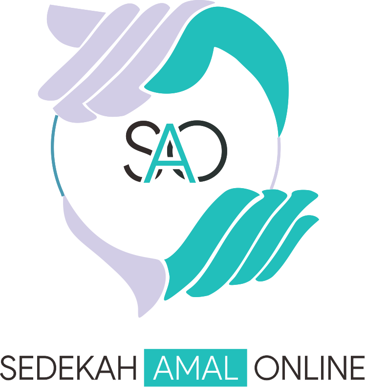
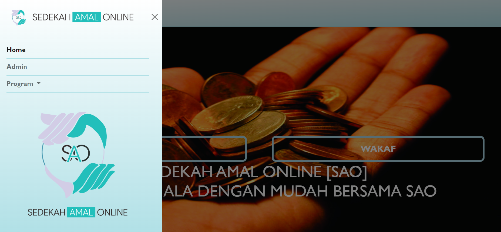
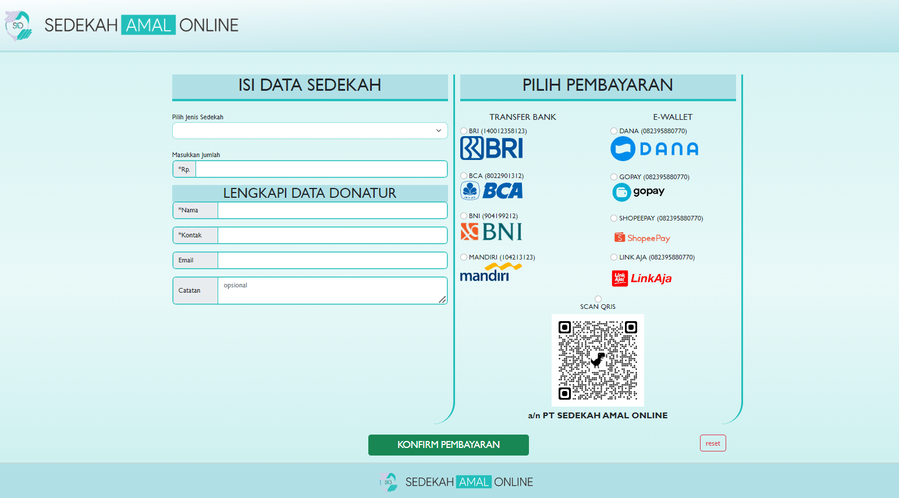
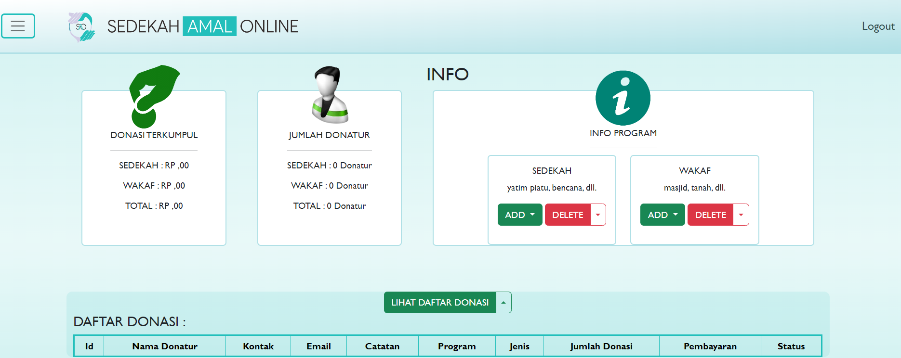

# Aplikasi Sedekah Amal Online (SAO)

  

## Tentang Proyek

**Sedekah Amal Online (SAO)** adalah aplikasi berbasis web yang dirancang untuk memudahkan pengguna dalam melakukan donasi sedekah dan wakaf secara online. Aplikasi ini dibangun menggunakan PHP, HTML, CSS (Bootstrap), dan JavaScript.

## Fitur

### Sisi User
- **Tampilan Home:** Halaman utama yang menampilkan informasi umum tentang platform.
- **Tampilan Sedekah:** Halaman khusus untuk pengguna melakukan sedekah secara online.
- **Tampilan Wakaf:** Halaman khusus untuk pengguna melakukan wakaf secara online.

### Sisi Admin
- **Dashboard Admin:** Halaman utama admin untuk mengelola informasi.
- **Tabel Riwayat Donasi:** Halaman yang menampilkan daftar lengkap riwayat donasi yang dilakukan oleh pengguna.

## Cara Akses

### Persyaratan:
1. Pastikan Anda telah menginstal XAMPP atau web server sejenis untuk menjalankan aplikasi web.

### Langkah-langkah Instalasi:
1. **Clone Repository:**
2. **Import Database:**
Buat database baru untuk aplikasi ini di phpMyAdmin atau sejenisnya. Import file sao.
3. **Running**
Pastikan XAMPP atau web server Anda sudah berjalan (Apache+MySQL running). Buka browser dan akses http://localhost/path

## Dokumentasi

### Tampilan Home

### Tampilan Donasi

### Dashboard Admin

